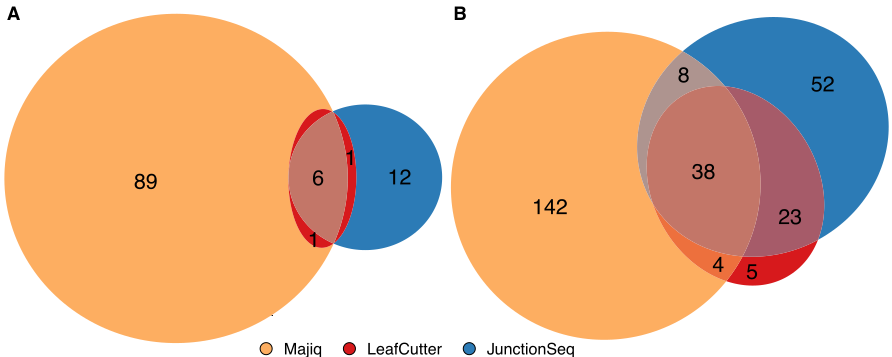
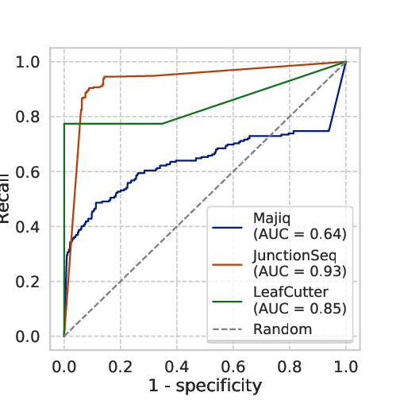
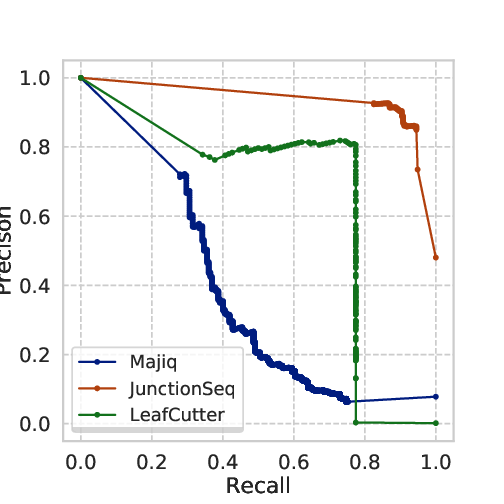

We implemented a benchmark method for DJU methods using the Spike-In RNA Variants (SIRVs Set-1, cat 025.03[^2]) as ground-truth for alternative splicing identification.
Differential splicing methods often use simulated data for benchmark, which does not fully appreciate the complexity of RNA-Sequencing experiment. We use a complementary approach that aims to overcome this limitation. The SIRVs spike-in comprise seven genes, 69 transcript isoforms, 357 exons and 113 intron
According to our experimental design (__Fig. 5.1__), differences in transcript abundance lead to differential splicing events in SIRV chromosomes but not in the human contigs, which would represent false-positive calls. 

To benchmark the dataset, we use Baltica to run the three tools comparing three groups:  
- mix 2 versus mix 1  
- mix 3 versus mix 2  
- mix 3 versus mix 1  

!!!important
    The test data currently shipping with Baltica has only a subset of 10% of the reads per group in Gerbracht et al. 2020 ([E-MTAB-8461](https://www.ebi.ac.uk/arrayexpress/experiments/E-MTAB-8461/)).

{: .center} __Fig. 5.1: Experimental design__: The first column represents the experimental groups. See [@Gerbracht_2020] for detail on the biological differences among groups. The second column represents the SIRV mixes. The third column is the sample id from the sequencing facility. 

## RNA-Seq processing and mapping

Cell lines, RNA extraction, and RNA-Seq were described by [@Gerbracht_2020]. In short, we obtained 15 libraries from Flp-In T-REx 293 cells, extracted the RNA fraction, with TrueSeq Stranded Total RNA kit (Illumina), followed by ribosomal RNA depletion, with RiboGold Plus kit. Reads were sequenced with an Illumina HiSeq4000 sequencer using PE 100bp protocol and yield around 50 million reads per sample. Data is deposited in ArrayExpress (E-MTAB-8461).
Sequenced reads' adapters and low-quality bases were trimmed, and reads mapping to human precursor ribosomal RNA were discarded.
The remaining reads were aligned to the human transcriptome (version 38, EnsEMBL 90) extended with the SIRV annotation.
Regarding the DJU method benchmarking, we are not interested in the biological condition, but the SIRVs AS event, and so this experiment was designed, so the SIRVs mixes were not confounded to the biological factors.

[^2]: https://www.lexogen.com/sirvs/#sirvsdownload - Lexogen took no part in the experimental design neither we have any relationship with the company.

## DJU method produces results with little agreement

To demonstrated the previously observed lack of consensus among DJU methods, we computed DJU with JunctionSeq, Majiq, and Leafcutter with the SIRVs, for three mixes containing a variable abundance of each transcript. The difference abundances are equivalent to differences in junction usage. The mixes were incorporated into the RNA-Seq experiment in non-confounded design with the biological co-variates, so the SJ observed in the natural contigs (human chromosome) could be used as false-positive calls. __Table 5.1__ shows the number of SJ identified and called significant ( see the [Workflow Chapter](integration.md) for detains on how the we reconcile these results). Majiq and JunctionSeq call around 310 significant SJ, while Leafcutter calls 201. Overall, the methods produce a comparable number of SJ called significant.

| - | Junctionseq | Majiq | Leafcutter |
| - |------------:|------:|-----------:|  
Total | 608 | 2850 | 131676 
Significant | 311 | 309 | 201

__Table 5.1__: Number of SJ considered (Total) and called significant (Significant) for each method.

However, when comparing the resulting gene and SJ sets, we observe a limited intersection among the results from the three methods (__Fig. 5.2__) for genes and SJ. To further understand this issue, we reviewed the step-by-step process implemented by the methods. Overall, the three DJU methods share three steps, as mentioned before:  

- Reads are extracted and filtered from the read alignments.
- Testable SJ or splicing events are identified, for example, by clustering.
- The SJ or splicing events counts are modelled.

__ Fig. 5.2: Overlap between genes and SJ called significant by three DJU methods.__ JunctionSeq, Majiq and, Leafcutter deliver results that show a limited agreement among each other. We computed differential junction usage using the three methods on 15 RNA-Seq libraries with 3 groups, the three SIRV mixes. The resulting intersection shows that only small overlap genes (__A__) and SJ (__B__) called significant by the tools 9% (6 out of 66) and 16% (34 out of 212), respectively.

## Benchmark

We extracted all introns from the SIRV transcripts and classified between diff (changing between mixes) and no diff. Given the binary outcome from each tool, we analysed the following cases:

- True positive: diff intron called significant 
- False-positive: no diff intron or intron in human contig called significant  
- True negative: no diff not called significant  
- False-negative: diff intron not called significant  

## Results from the methods benchmark 

| | TN | FP | FN | TP|
|-------|---:|---:|---:|---:|
|Majiq       | 2492   | 126 | 90 | 82  |
|JunctionSeq | 273    | 43  | 24 | 268 |
|Leafcutter  | 131474 | 43  | 1  | 158 |  

__Table 5.2: Methods and number of SJ in each classification case __

Junctionseq achieves the highest number of TP calls and Junctionseq and Leafcutter the lowest number of FP calls. Based on that procedure, we proceeded with a two-class validation and computed the Receiver Operating Characteristic (ROC) curve and the precision-recall curve. 

     

__Fig 5.3 ROC and Precision-recall curve__: we observe the in this benchmark JunctionSeq outperforms Majiq and Leafcutter. 

The curves shows that Junctionseq outperforms the other two methods in the conditions we have analysed.

Despite the punctual similarities, the implementation of these three state-of-art methods vary. Here we present a direct comparison on a set of artificial transcripts. The cumulative differences in who to define which SJ are extracted and tested; how much the method relies on the annotation; and the framework for statistical modelling explain the small intersections in __ Fig. 5.2 __.

In this case, Leafcutter suffers from a recall ceiling issue, because it ignores certain introns from the artificial transcripts. JunctionSeq has a clear advantage in this comparison because it relies heavily on the information of the annotation and the input annotation, that in this case, perfectly represents the structure of the transcripts.
Majiq suffers from an excess of false-positive calls. Baltica aims to futher study these implementations differences and potentially suggestion advice to minimize the effect of the limitations mentioned above.

\bibliography

<!-- This benchmark uses the SIRV complete annotation. Junctionseq would not perform as well in incomplete annotation or over-annotated cases  -->