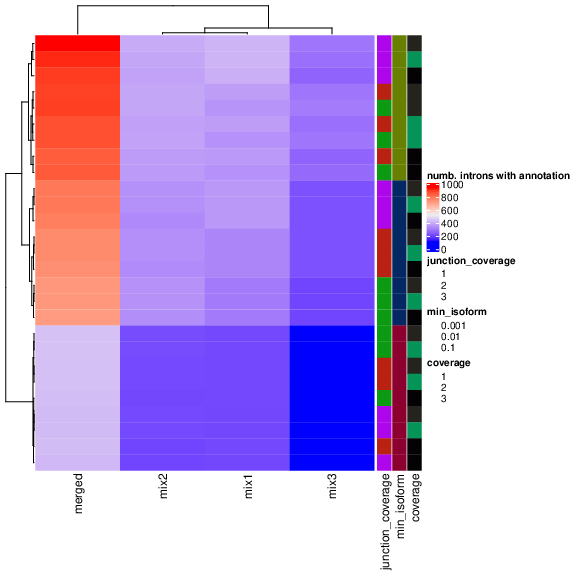
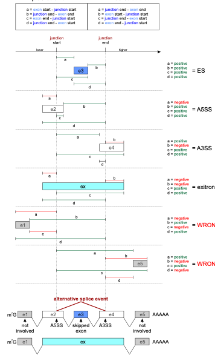

# Integration

## Parsing the results of the method

The first step in the analysis workflow is parsing and processing the DJU methods' output with `scripts/parse_{method}_output.R` scripts as follows:

1. The resulting text output from the DJU methods is parsed and loaded as R data frames
1. The data frames are pivoted in a longer format to have one junction and one comparison per row  

!!! warning
    RMATs, Majiq, and Leafcutter use AS events to test for DJU, so metrics are associated with a group and not the SJ. In Baltica, we split these groups in SJ, and multiple SJ may have the same metric, for example, test statistics.

<!-- !!! warning
    majiq and rmats may be assigned multiple scores to an SJ to different AS types. For these, Baltica selects the maximum score as the representative.  
 -->
!!! note
    For unstranded RNA-seq libraries, JunctionSeq output genomic coordinates without the strand information.
    Therefore, we support the integration by eliminating the strand from the analysis.
    However, we recommend against generating unstranded RNA-seq libraries in 2021.  

## Result integration

One challenge for the integration of DJU results is that the methods use different genomic coordinate systems.
The coordinates system's differences are due to the method implementation: methods can be 0-indexed (BED format) versus 1-indexed (GTF format) or use the exonic versus intronic coordinates to represent the SJ genomic position.
We propose a `filter_hits_by_diff` function to find overlapping features and then discard any overlaps with more than two bp differences to account for the multiple genomic coordinates system.
The multiple hits form a graph, which is then partitioned into the clusters, and each cluster represents an intron.
This feature enables the reconciliation of the multiple DJU results.

## Annotating the results

We annotate the results with information from genes and transcripts hosting the SJ.
For this, we use the _de novo_ transcript annotation at `stringtie/merged/merged.combined.gtf`.
Commonly, multiple transcripts share an intron so that a single intron may be annotated with multiple transcripts.

These are the columns assigned after the annotation:

### Table 1: Annotation description

Column name | Description |
------------|-------------|
comparison | pairwise comparison as `{case}_vs_{control}` |
chr | seqname or genomic contig |
start | intron start position for the SJ |
end |  intron end position |
strand | RNA strand that encodes that gene |
gene | the gene symbol |
e2 - e1| acceptor and donor exons number, if in + strand else the inverse |
tx_id | transcript identifier from the combined annotation |
transcript_name | transcript name |
class_code | association between reference transcript and novel transcript ([seq fig1 for details]( https://doi.org/10.12688/f1000research.23297.1)) |

## Selecting optimal parameters for _de novo_ transcriptome assembly

!!! warning
    The section below was obtained in a previous Baltica release, using stringtie v1.2.X, but we don't expect major changes in current version.

We found that the parameters used to obtain the _de novo_ transcriptome are critical for maximum integration between the GTF and the SJ from DJU methods.
__Fig 1__ shows a parameter scan where we vary the group, `-j` (minimum junction coverage), `-c` (minimum coverage), and `-f` (minimum isoform proportion) and compute the number of transcripts that match with SJ called significantly.
As expected, the merged annotation and not the group-specific annotation have the highest rate of annotated introns.
The crucial result here is the dependency of the `-f` parameter, which is also associated with an increased number of annotated introns.
As we confirmed this behavior in other datasets, we decided to use `-c 3 -j 3 -f 0.01` as default values in Baltica.
The higher coverage (`-c` and `-j`) values counter the potential noise of transcripts with low abundance.

  
__Fig 1__:Parameter scan to maximize the number of introns annotated.
We have run Stringtie with multipleparameters of merged annotation or group annotation; junction coverage of 1, 2, or 3; coverage of 1, 2, 3, and minimum isoform fraction of 0.1, 0.01, or 0.001.
The result shows a dependency of the minimum isoform fraction parameter, which needs to be minimized to increase the proportion of annotated SJ, as expected.

## Assigning AS type

### Biological motivation

Identifying the type of AS is critical to understand a potential molecular mechanism for AS events. [SRSF2](https://www.uniprot.org/uniprot/Q01130) is a relevant example in this context. SRSF2 is splicing factors from the SR family that are known for auto-regulation. In certain conditions, the SRSF2 transcript can activate the nonsense-mediated decay by either including a new exon containing a premature stop codon or an intron in  3' UTR. These changes lead to transcript degradation and overall reduction of gene expression. Thus, the reduction of SRSF2 protein level leads to widespread exon skipping. Identifying such patterns is critical to understanding which splicing regulators are driving the observed splicing changes, and it enables further analysis of AS events of a specific type.

### Implementation

In Baltica, we use a geometric approach to define AS in three classes:

- ES, for exon skipping
- A3SS, for alternative 3' splice-site
- A5SS, for alternative 5' splice-site

Figure 2 details how we use the distance between features start and end to determine the AS type.

{ : .center width=70% }  
__Fig 2__: AS type assignment in Baltica. Baltica uses the genomic coordinates from the SJ and its overlapping exons to assigning AS type to SJ and its overlapping exons. Because many exons may be affected, multiple assignments are output. For example, donor and acceptor exons are assigned as JS and JE, respectively.

## Simplify the AS event

Because most of the final users are only interested in the list of genomic ranges, gene names, or event types, we offer a simplified output that removes redundant information. This step helps generate a final report.

## References

\bibliography
