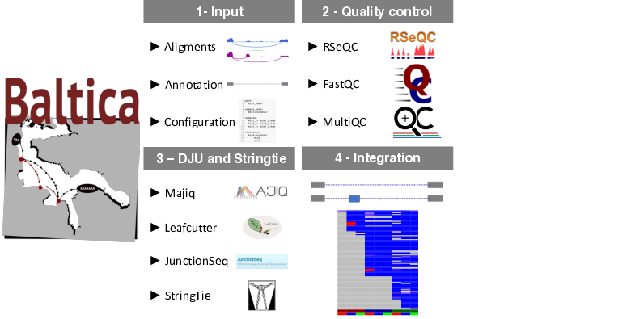

This document details on the implementation and usage for each workflow in Baltica.

Baltica comprises a collection of Snakemake workflows (in the SMK format). Each file determines a series of sub-tasks (rules). The sub-tasks run in a specific order; once the output of every rule is complete found, the workflow is considered successful. The following workflows were implemented following instructions and parameters suggested by the methods authors unless otherwise noted.

{ .center }
__Fig. 4.1 - Baltica overview__: As input (1), Baltica takes the alignment (BAM format) files, and transcriptome annotation and a configuration file that matches the sample names to the alignment file. The file also holds any workflow parameters. In the first optional step (2), Baltica produces a quality control report with MultiQC, which summarizes the results from FastQC and RSeQC. Next (3), Baltica computes the DJU methods and produces a _de novo_ transcriptome with Stringtie. The novel exons and transcripts are indispensable for the integration step (4). Finally, the output of the DJU methods is parsed

Which are achieved by successively calling: 

1. Input
1. Quality control:   
`baltica qc config.yml`
1. Differential Junction Usage (DJU) and _de novo_ transcriptomics:   
`baltica junctionseq config.yml`  
`baltica majiq config.yml`  
`baltica leafcutter config.yml`  
`baltica stringtie config.yml`  
1. Integration:   
`baltica analysis config.yml`

!!! important
    The transcriptome annotation is also important, so make sure you use the same annotation for read alignment and in Baltica parameter.

!!! note
    The impact on read alignment on DJU methods results were not fully explored. Expect different results from DJU methods, when comparing alignment files produced by different transcriptome aligners. We recommend STAR. 
   

## Method inclusion criteria

There are a plethora of DJU methods, defined as methods that model SJ to identify differential splicing. Bellow is the inclusion criteria we used for Baltica. Methods are required to

- use as input RNA-Seq read alignment in the BAM format
- to detect AS splicing as changes on SJs level, not at the transcript level
- provide test statistic that compares a control group to a case group
- output effect size estimates, such as the deltaPSI
- detect unannotated SJ

We are aware of other methods, such as Suppa [@Trincado2018] and rMATs [@Shen_2014], also fit these criteria and aim to expand the catalogue of supported methods in the future.

## Baltica configuration

The configuration file contains the parameters for workflows and file paths for input requirements and output destination.
 We use the JSON file format as a[configuration file](https://snakemake.readthedocs.io/en/stable/snakefiles/configuration.html). 
Please see a minimal working example [here](https://github.com/dieterich-lab/Baltica/blob/master/baltica/config.yml). 

The following parameters are mandatory:

Parameter name | Description | Note     
-------------- | ----------- | ---- 
`path` |  absolute path to the logs and results  |  
`sample_path` | path to the parent directory to the alignment files |  
`samples` | sample name to alignment files (BAM format) a condition name | [^1]
`comparison` |  pair of groups to be tested |
`ref` |  full path to the reference transcriptome annotation in the (GTF format) | 
`ref_fa` | full path to the reference genome sequence in the FASTA format | [^2]  
`*_env` | Used if the required dependency is __not__ available in the path | [^3]
`strandedness` | choice between `reverse`, `forward` or None | [^4] 
`read_len` | positive integer representing the maximum read length | [^5]

[^1]: We use the following convention for the sample name: `{condition}_{replicate}`, where the condition is the experimental group name without spaces or underline character, and replicate a positive integer
[^2]: Used by Majiq for GC content correction
[^3]: User should prefer `--use-conda` or `--use-envmodules`; however if it's not possible to load the requirements for, this hack may help 
[^4]: Check RSeQC infer_experiment result 
[^5]: Check FastQC Sequence Length Distribution report

!!! note
    Junctionseq and Leafcutter support more complex designs, but these are not currently implemented in Baltica.

## Quality control workflow

The first step comprises the quality control of sequenced libraries and read alignments.
This step aims to determine the success of sequencing and alignment.
Baltica includes workflows for RSeQC [@Wang2012] and FastQ. MultiQC [@Ewels_2016] summarizes the output from both tools.
In addition to the quality control, the tests may suggest biological differences among conditions.
For example, RSeQC provides the proportion of reads per feature in the input annotation, which may show an increase users may identify enrichment of reads mapping to intronic regions, indicating either intron retention or accumulation of unspliced mRNA.
RSeQC also implements an SJ saturation diagnostic, which quantifies the abundance of known and novel SJ.
This metric relates to the sequencing depth. This diagnostic is done by sampling subsets of the dataset to identify which proportion of annotated and novel introns are observed in the sub-samples. 
In conclusion, the quality control step serves to identify potential problems with the RNA-Seq library alignment and, potentially, direct on further troubleshooting and downstream analysis.

### Software dependencies

Name | Version   
-----|---------
RSeQC | 2.6.4 
FastQC  | 0.11.8  
MultiQC | 0.8  

<!-- [^1]: https://www.bioinformatics.babraham.ac.uk/projects/fastqc/Help/
[^2]: http://rseqc.sourceforge.net/#usage-information
[^3]: https://multiqc.info/docs/
 -->
## DJU workflow

In term of implementation, the DJU tools use the following steps:  

1. Extracting split reads from the alignment file    
1. Defining which SJ or events should be tested  
1. Modelling the SJ/events abundance  

Unfortunately, there are differences the differences in implementation among the tools that lead to results that are not trivial to compare. 

### Leafcutter workflow

Leafcutter uses a series of scrips to extract the split reads from the BAM files. Recently, this step was changed to use [regtools](https://github.com/griffithlab/regtools) to speed up the process. Our test show that this new step affects the workflow results, and so we have not implemented the change in Baltica.

1. Extracting intron from the alignments files: reads with M and N cigar are extracted from the alignments, giving a
minimum read overhang
1. Intron clustering: introns with at least `minclureads` (default: 30) reads and up to `maxintronlen` kb (
 default: 100000) are clustered. The clustering procedure iteratively discards introns supported by less than 
 `mincluratio` reads within a cluster.
1. Differential splicing analysis: Leafcutter uses a Dirichlet-Multinominal model to model the usage (proportion) of a 
giving SJ within a cluster and compare this usage among conditions

<!-- !!! info

  If you annotation use non-canonical chromosome names, you may have to change Leafcutter clustering scrip
 -->
!!! info
    By default, Leafcutter clustering does not use the read strandedness information. In Baltica, we override these parameters and use the strand information for clustering.

#### Software dependencies

Name | Version    
-----|---------
python | 2.7 
R | 3.5 
samtools | 1.9 

#### Parameters

Rule | Name | Default | Note
-----|-----|---------|------
`bam2junc` | `use_strand` | TRUE | 
`intron_clustering` | `minclureads` | 30 |
`intron_clustering` | `maxintronlen` | 100000 |
`intron_clustering` | `mincluratio` | 0.001 |
`differential_splicing` | `checkchrom` | TRUE |  
`differential_splicing` | `min_samples_per_group`  | 2 |
`differential_splicing` | `min_samples_per_intron` | 2 | 
`differential_splicing` | `fdr` | 0.05 |

#### Output

The relevant output from Leafcutter is `_cluster_significance.txt` and 
`_effect_sizes.txt`, which are computed for each comparison. Baltica parses these files.

Column description:

`*_cluster_significance.txt`:
1. `cluster`: `{chromosome}:{intron_start}:{intron_end}`
1. `Status`: is this cluster testable?
1. `loglr`: the log-likelihood ratio between the null model and alternative 
1. `df`: degrees of freedom, equal to the number of introns in the cluster minus one (assuming two groups)
1. `p` unadjusted p-value dor the under the asymptotic Chi-squared distribution

`*_effect_sizes.txt`:
1. `intron`: intron identifier on the format `chromosome:intron_start:intron_end:cluster_id`
1. `es`: effect size
1. `{cond_1}`: fitted junction usage in condition `cond_1`
1. `{cond_2}`: fitted junction usage in condition `cond_2`
1. `deltapsi`: difference between usage in the two conditions  

## Majiq workflow

Majiq workflow is implemented as follows:

1. Create a configuration file (`majiq/build.ini`)
1. __Majiq build__ generates the Splice Graph database with exons and SJ from the RNA-Seq experiment and the reference annotation
1. __Majiq deltapsi__: - computes PSI and deltaPSI and tests the if the deltaPSI changes between comparisons are significant 
1. __Voila tsv__: filter and process the Majiq output

Majiq also provides a visualization with the `voila view` that we find helpful. 

### Software dependencies

Name | Version    
-----|---------
python | 3.6 
htslib | 1.9 

### Parameters

Rule | Name | Default | Note
-----|------|---------|------
create_ini | `assembly` | | name of the assembly on the UCSC genome browser
create_ini | `strandness` | reverse | RNA-Sequencing library type 
create_ini | `read_len` |  100 | maximum read lenght
voila tsv | `--majiq_threshold` | 0.2 | DeltaPSI cutoff for probability calculation

## Output

Detailed information of Majiq's output can be found in the [Majiq's online documentation](https://biociphers.bitbucket.io/majiq/VOILA_tsv.html)

<!-- build |   |  -->
<!--  `--min-experiments`
    - Description:Iinteger or proportion of the minimum number of experiments a LSV event is observed to be considered
  - Default: 0.5
   
   `--min-intronic-cov`
  - Description: Minimum number of coverage an intron needs to be tested for intron retention events
  - Default: 0.01
  
   `--min-denovo`
  - Description: Minimum number of reads at all positions in an LSV to consider a de novo junction 
  - Default: 2
  
    `--minreads`
    - Description: Minimum number of reads at all positions in an LSV to consider an LSV
  - Default: 3
  
  `--minpos`
  - Description: Minimum number of start positions with at least one read in an LSV to consider that the LSV "exist in the data".
  - Default: 2

    `--markstacks`
  - Description: p-value threshold (or negative number to disable) to mark stack positions 
  - Default: 1e-07

    `--k`
  - Description: Number of positions to sample per iteration.
  - Default: 50

    `--m`
  - Description: Number of sampling steps using on bootstrap
  - Default: 30
  - baltica: -->

<!-- - For Majiq deltapsi:  
  
    `--binsize`
  - Description: Number of bins for the PSI value distribution 
  - Default: 0.025

    `--prior-minreads`
    - Description: Minimum number of reads at all to included 
  - Default: 20

    `--prior-minnonzero`
  - Minimum number of positions for the best set.
  - Default: 10
 -->
<!--    `--non-changing-threshold`
    - Description: None 
  - Default: 0.05

   `--probability-threshold` 
  - Description: None
  - default: off
 -->

## JunctionSeq workflow

JunctionSeq [@Hartley2016] tests statistical significance over difference usage among exonic and intronic disjoint genomic bins. It takes as input read count matrix obtained with QoRTs [@Hartley_2015], for annotated SJ, novel SJ, and exons, so in fact, JunctionSeq fits both the DEU and DJU classifications. 
Bins selected as testable as modelled with generalized linear models, as described in DEXSeq [@Anders2012], but reporting a test statistic at the genomic feature (exon or junction) and gene level.
Different from other DJU methods, JunctionSeq does not group the SJ in AS events, and so it does not compute PSI events.
By default, SJ with p.adjust < 0.05 are called significant.

### Software dependencies

Name | Version    
-----|---------
R    | 3.6 
qorts | 1.1.8

Qorts depends on Java. We currently use it with Java 11.0.6. JunctionSeq itself relies on a series of BioConductor packages.

### Parameters

Rule | Name | Default | Note
-----|------|---------|------
qc   | `strandness` | reverse | 
qc   | `read_len`   | 100 |
qc   | `is_single_end` | True | 

### Output

Detailed output information can be found on page 14 of the [JunctionSeq Package User Manual](https://github.com/hartleys/JunctionSeq/blob/13a323dda5fae2d7e74b82230824affb747d938d/JunctionSeq/vignettes/JunctionSeq.Rnw#L514)

## Stringtie workflow

Baltica uses splice graph information to determine the reconcile the SJ coordinates and to and assign AS type. 
 
De novo transcriptomic workflow is procced with Stringtie [@pertea_2015]. First, we merge the alignment files from biological replicates. Next, we compute _de novo_ annotation with Stringtie (v1.3.5) with  `-c 3`, `-j 3` and `-f 0.01`. Finally, the we merge the multiple annotation with `gffcompare -r {reference_annotation.gtf} -R -V`. The parameter selection is further detailed on the [Integration chapter](integration.md). 

### Software dependencies

Name | Version    
-----|---------
Stringtie | 1.3.5 

### Parameters

Rule | Name | Default | Note
-----|------|---------|------
create_ini | `assembly` | | name of the assembly on the UCSC genome browser

\bibliography